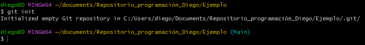
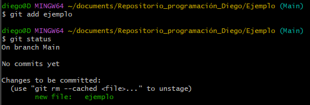

Para crear un repositorio local lo primero que haremos será crear un directorio donde irá nuestro repositoio local, para esto usaremos la carpeta "Ejemplo" que creamos en el tutorial del uso de la consola y accederemos a ella con los comandos aprendidos.

Como se puede apreciar al usar el comando *ls* solo tenemos el archivo de texto ejemplo, si usamos el comando *ls -al* podremos apreciar que aparte de ese archivo solo están los archivos que nos permiten ingresar y salir de la carpeta: 

Ahora usaremos el comando *git init* para convertir nuestra carpeta en un **repositorio local**, ejecutaremos el comando y después de un breve momento nos saldrá en verde un nombre al lado de la carpeta que dirá "*Master*" o "*main*" dependiendo de la configuración que tengamos, ese es el nombre de la *rama* o en ingles *Branch*. En dicha rama es donde se guardarán los cambios que hagamos al repositorio.

Como se aprecia en la consola git nos dice que se creó un directorio llamado .git, sin embargo al usar el comando *ls* no podremos verlo, debido a que es un archivo oculto, así que usaremos el comando *ls -al*.

Ahí tenemos nuestro archivo ".git", este es el que nos dice básicamente que el directorio es ahora mismo un repositorio. Dentro del directorio podremos encontrar todo tipo de archivos que llevan el registro de lo que hacemos y deshacemos en nuestro repositorio, ahora, digamos que creamos un archivo y queremos guardar ese cambio en el repositorio, para esto usaremos los comandos: "*git status, git add y git commit -m*" Empezaremos creando un archivo nuevo con el comando *touch* y luego usaremos *git status*.

podemos apreciar que el archivo creado está ahí y aparece en **rojo** y dice que no se le está dando un seguimiento, esto quiere decir que si subimos el cambio al repositorio con el comando *git commit -m* no se subirá el archivo con los cambios.

Lo siguiente que haremos será usar el comando *git add* seguido del nombre del archivo, para poder "subirlo al stage" o darle seguimiento y una vez hecho esto, usaremos de nuevo *git status* para ver los cambios realizados.

Se observa como el archivo ahora aparece en color **verde** y dice que es un cambio al que se le puede hacer *commit*, esto quiere decir que se guardará el cambio cuando usemos *git commit* y es lo que haremos, usaremos *git commit -m* seguido de un nombre para el **commit**.

En este caso por demostración elegí el nombre "Nombre del commit 1", y como se puede apreciar, con *git status* dice que no hay cambios que guardar, ahora, si queremos ver el historial de cambios que hemos hecho se puede observar con el comando *git log* o de una forma más abreviada con el comando *git log --online*.

Podemos ver como *git log* nos da más información como el autor, su correo, la fecha, etc. En cambio con *git log --oneline* Solo vemos el código de 7 dígitos del commit, la rama en donde se ubica y su nombre, esté código de 7 dígitos sirve para acciones más avanzadas que no cubriremos aquí como cambiar el nombre, regresarse a otra versión, combinar ramas, etc.

Eso es todo, para regresar al README click aquí: [Regresar](../README.md)
