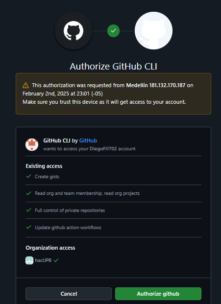

Hay 2 métodos para poder crear un repositorio en la nube de *GitHub* así que aquí explicaré uno más técnico, para esto tendremos que haber instalado una extensión de comandos llamada: *GitHubCli* con esta iniciar sesión desde nuestro computador será tan simple como usar el comando "*gh auth login*".

A continuación se nos darán a escoger varias opciones, en las cuales podremos navegar con las flechas y las cuales aceptaremos presionando la tecla "**ENTER**"

Seleccionaremos las opciones que más nos convengan, en este caso yo elegí "GitHub.com" donde lo uso, "HTTPS" como mi protocolo preferido, elegí autenticar "Git" con mis credenciales de "GitHub" e iniciar sesión con un navegador web. Acto seguido me dan un código y al presionar enter se debe abrir el navegador para iniciar sesión y colocar el código, autorizamos a "GitHub" a conectarse con nuestra cuenta y con "GitHubCli" y finalmente colocamos nuestra contraseña, debería ser algo como esto: 

Una vez hecho esto ya podremos usar la siguiente línea de comando para crear nuestro repositorio en linea "*gh repo create demo2 --public --source=. --push --remote=upstream*". Esta línea configura varios parámetros de una sola vez, "*gh repo create*" sirve para dar la orden de crear el repositio en la página dándole por nombre lo que coloquemos en la siguiente parte en este caso "*demo2*". La parte "*--public*" hace que nuestro repositorio se cree siendo de carácter público, "*--source=.*" sirve para definir donde quedará el repositorio, en este caso al usar el archivo "*.*" se creará en la carpeta en la que estemos al momento de crearlo, "*--push*" sirve para enviar los commits que tengamos actualmente a la nube y "*--remote=upstream*" sirve para asignar el nombre de la conexión remota, en este caso "*Upstream*" este nombre se puede modificar a voluntad sin mayor dificultad. Al usar el comando nos saldrá lo siguiente:

Como se aprecia, yo ya había creado un repositorio con el nombre demo2, así que elegí por nombre "Prueba" y se creó sin complicaciones, también habiamos creado el *commit* "Nombre del commit 1" así que al usar "*--push*" lo enviamos automáticamente al repositorio en la nube para revisar esto, usaremos "*git log*" donde veremos lo siguiente:

Se observa que aparece nuestra rama anterior "**Main**" y ahora una que se llama "**upstream/main**" esta es donde se combinan ambas cosas, nuestro repositorio local y nuestro repositorio en la nube. Por tanto ahora hay un paso extra, y este paso es después de un *commit* usar el comando *git push* para guardar los cambios en la nube. Para ejemplificarlo haremos un "Commit 2".

Se aprecia que nos dice, tras hacer el *commit* que no hay nada que agregar, pero que nuestra *rama* se encuentra por encima de *"upstream/Main"* por un *commit*, lo que quiere decir que nuestros cambios no se han guardado en la nube, para solucionar esto, usaremos el ya mencionado *git push*.

Ahora sí, nos dice que nuestras *ramas* están ambas al día, para ver esto un poco más gráficamente lo podemos ver desde *"git log"* o desde "*git log --oneline*"

 
 Como se observa, *Main* y *upstream/Main* están en el mismo sitio, si tuvieramos un *commit 3* y no hicieramos "*git push*" *upstream/Main* quedaría abajo.

 

 Cosa que resumidamente significa que no hemos guardado o "subido" los cambios a "*upstream/Main*"

 Eso es todo, para regresar al README click aquí: [Regresar](/README.md)
 
  