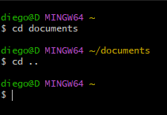
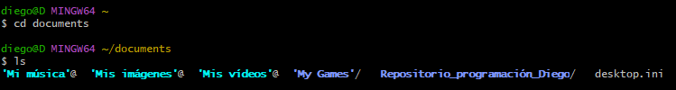
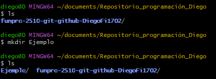
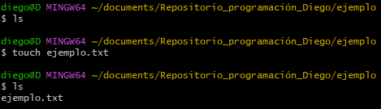
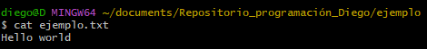
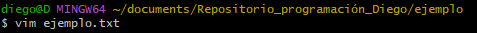

En este archivo vas a encontrar los comandos básicos para el uso de la consola.

Podemos enlistarlos de cierta forma para tener presentes cuales serían, en este caso los más básicos serían: cd, ls, ls -al, mkdir, touch, cat y vim.

Empezaremos hablando del commando "cd", este nos permite entrar en los diversos directorios del computador, permitiendonos, "navegar" entre los diferentes archivos. Para eso colocaremos el comando seguido del nombre del directorio así: **"cd nombre"**. Podremos ver la ruta en la que estamos ingresando en la parte superior de color **amarillo**. Este comando tiene una variación en la que no colocaremos ningún nombre de directorio y será para regresar a la carpeta anterior para esto usaremos el comando *cd* seguido de la terminación "..".  

El siguiente comando del que hablaremos es el comando "*ls*" este nos permite ver los diferentes archivos que existen en el directorio en que hayamos entrado. Sin embargo no veremos todos los archivos, más adelante hablaremos de esto. En este caso, entraremos a la carpeta *documents* con el comando anterior y miraremos su contenido.

A continuación usaremos una pequeña variación del comando *ls* en la que agregaremos un espacio y colocaremos "**-al**" esto nos servirá para revisar los archivos "ocultos" del directorio en donde estemos. Por separado los comandos "*-a*" y "*-l*" cumplen funciones diferentes: *-a* nos permite ver los archivos ocultos y *-l* nos deja ver los permisos de los archivos, es por esto que se complementan tan bien y recomiendo usarlos juntos.

Para ya ir terminando empezaremos a crear directorios, para esto usaremos el comando "*mkdir*" para usarlo basta con colocarlo dejar un espacio y colocar el nombre que queremos para el directorio, esto creará una carpeta la cual podemos verificar que ha sido creada con *ls*.

Otro comando cuyo uso es bastante simple es el comando "**touch**" este nos servirá para crear archivos en diferentes formatos, parta eso tendremos que agregar la terminación del formato que queramos, por ejemplo ".c, .txt, etc."
Basta con colocar *touch nombre del archivo y terminación* y listo.

Para terminar vamos a usar dos comandos parecidos pero algo diferentes, "**cat**" y "**vim**", con *cat* podremos **VER** solo **VER** el contenido del archivo y con *vim* podremos editarlo directamente en bash mediante una interfaz especial.
Para usar *cat* solo debemos colocar *cat* y el nombre del archivo, lo mismo para *vim*

El caso de vim es un poco más especial, ya que nos abrirá una interfaz nueva, pero la manera de colocar el comando al inicio es la misma que la anterior.

Entonces cuando presionemos enter nos saldrá la siguiente interfaz: 

Aquí debemos presionar la tecla I para acceder al modo insert, en el cual podremos modificar el archivo y escribir en el. Para salir de este modo, presionaremos la tecla ESC. El modo *insert* se ve algo así:

Para poder guardar los cambios tenemos acceso a unos comandos especiales de la interfaz, estos serían "*:x*, *:q* y *:q!*, estos funcionan de la siguiente forma *:x* nos permite salir y guardar, *:q* salir sin guardar y *:q!* forzar la salida y no guardar. En este caso editaremos, usaremos :x y veremos los cambios con *cat*.

Eso sería todo, para regresar al archivo README puedes hacer click aquí: [Regresar](../README.md)

                                                                                                             

